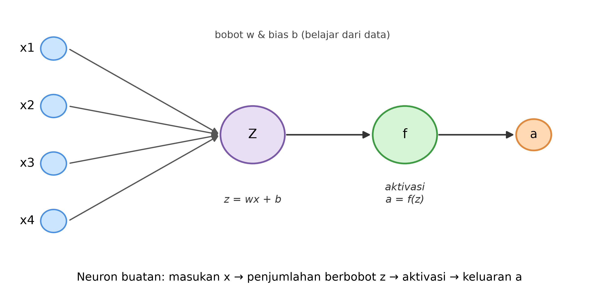

# Bab 2 — Regresi: Perceptron dan Jaringan Saraf untuk Prediksi Besaran

> **Prasyarat:** Bab 1 (tensor, konsep ML/DL). Kode memakai TensorFlow/Keras di Google Colab
> (bab 1: setup lingkungan).

## 2.1 Prediksi Besaran sebagai Masalah Regresi

Banyak pertanyaan meteorologi yang jawabannya berupa **angka**:

- Berapa suhu maksimum besok?
- Berapa milimeter hujan pada hari Jumat?
- Berapa tinggi pasang surut pada pukul 18.00 nanti?

Masalah seperti ini disebut **regresi** — memprediksi nilai kontinu dari pola di data.
Kontras dengan **klasifikasi** (Bab 3) yang memprediksi kategori (hujan/tidak hujan).

Regresi adalah masuk akal pertama untuk neural network: cara kerja neuron sama,
perbedaannya di lapisan keluaran dan fungsi *loss* yang dipakai (diukur dengan MAE/MSE,
bukan akurasi).

## 2.2 Anatomi Neuron: Bobot, Bias, dan Fungsi Aktivasi

Neuron buatan (artificial neuron) adalah unit dasar jaringan. Ia menerima beberapa masukan
`x`, mengalikan tiap masukan dengan **bobot** `w`, menjumlahkannya, lalu menambahkan
**bias** `b`:

$$ z = w_1 x_1 + w_2 x_2 + \dots + w_n x_n + b \tag{2.1} $$

Hasilnya "diaktifkan" oleh **fungsi aktivasi** `f`, menghasilkan keluaran:

$$ a = f(z) \tag{2.2} $$

Contoh paling sederhana adalah **perceptron** (Rosenblatt [1]): neuron dengan fungsi
aktivasi berbentuk aturan/tahan (mis. `a = 1` jika `z > 0`, selain itu `0`). Perceptron
membantu memahami istilah **bobot** dan **bias**, tetapi di Bab 2 ini kita pakai versi
"linear tanpa aktivasi" untuk regresi.



Persamaan (2.1) dan (2.2) diilustrasikan pada Gambar 2.1: setiap panah masukan membawa
satu komponen `x_i` yang dikalikan `w_i`, dijumlahkan menjadi `z` (nilai sebelum
aktivasi), lalu `f` menghasilkan keluaran `a`.

## 2.3 Satu Neuron Linear = Regresi Linear

Sebuah neuron **tanpa fungsi aktivasi** (identity) untuk satu masukan:

$$ \hat{y} = wx + b \tag{2.3} $$

Persamaan (2.3) identik dengan **regresi linear**. Bedanya di vocab: kita belajar `w` dan
`b` dari data lewat pelatihan (Bab 4), bukan dengan rumus kuadrat terkecil.

Mulai dari model ini dulu (baseline neural) sebelum menambah lapisan — prinsip
"mulai sederhana, lalu tingkatkan".

## 2.4 Kebutuhan Non-linearitas: Perkenalan ReLU

Data meteorologi jarang linear sempurna. Hubungan antara variabel (mis. kelembapan → hujan)
tidak bisa diwakili hanya garis lurus.

Jika kita menyusun beberapa neuron linear berlapis, hasilnya tetap linear (penjumlahan
fungsi linear = fungsi linear). Agar model mampu menangkap pola non-linear, tiap lapisan
perlu **fungsi aktivasi non-linear**.

Fungsi yang paling umum sekarang adalah **ReLU** (*rectified linear unit*):

$$ \text{ReLU}(x) = \max(0, x) \tag{2.4} $$

ReLU "menghidupkan" neuron hanya jika masukannya positif; sisanya 0 (lihat persamaan
(2.4)). Sederhana dan murah secara komputasi, dan menjadi komponen dasar banyak jaringan
modern [2].

**Membangun MLP (multi-layer perceptron)**: beberapa neuron yang disusun berlapis, diselingi
ReLU. Contoh arsitektur untuk memprediksi suhu (Kode 2.1):

```
Input: suhu-1 hari sebelumnya
  → Dense(8, activation='relu')
  → Dense(8, activation='relu')
  → Dense(1)  # regresi, tanpa aktivasi
```

**Kode 2.1 — Definisi arsitektur MLP regresi dengan Keras.**

```python
import tensorflow as tf

model = tf.keras.Sequential([
    tf.keras.layers.Dense(8, activation="relu", input_shape=(1,)),
    tf.keras.layers.Dense(8, activation="relu"),
    tf.keras.layers.Dense(1),
])
print(model.summary())
```

## 2.5 Mini-Kasus: Memprediksi Tinggi Pasang Surut Sederhana

Sebagai identitas "data laut Indonesia" (sesuai strategi umbrella), kita mulai dengan
contoh kecil: data pasang surut stasiun lokal. Pasang surut bersifat periodik (semi-diurnal
maupun diurnal di perairan Indonesia [3]) sehingga cocok untuk regresi sederhana.

Pendekatan paling dasar: memprediksi tinggi air **besok** berdasarkan tinggi air **hari ini**
dan **kemarin** (2 fitur). Data nyata pasang surut akan dibahas penuh di Bab 8; di sini hanya
memperkenalkan:

```
input: [tinggi(t-1), tinggi(t-2)]  →  densely →  output: tinggi(t)
```

Ini memakai persis konsep neuron/ReLU di atas. Hasil MAE/RMSE diukur; kita juga bandingkan
dengan baseline *persistence* ("prediksi = nilai hari ini").

## 2.6 Mengukur Kesalahan: MAE vs MSE

Dua fungsi *loss* regresi yang paling umum:

**Tabel 2.1** — Perbandingan MAE dan MSE sebagai fungsi kesalahan regresi.

| Loss | Definisi | Sifat |
|---|---|---|
| **MAE** (*mean absolute error*) | rata-rata `\|selisih\|` | Tahan terhadap pencilan; satuannya sama dengan data |
| **MSE** (*mean squared error*) | rata-rata `selisih²` | Memberi hukuman besar pada kesalahan besar (kuadrat) |

Di meteorologi, keduanya dipakai (Tabel 2.1); data seperti curah hujan memiliki distribusi
dengan ekor kanan (kadang nilai sangat besar), sehingga pilihan loss bisa memengaruhi
perilaku model. Prinsip: pilih sesuai skala & tujuan, dan selalu bandingkan dengan baseline
(Bab 7).

## 2.7 Adam, Learning Rate, dan Split Waktu

- **Adam** adalah algoritma optimasi (turunan dari gradient descent) — mengatur besar
  langkah penyesuaian bobot per iterasi. Diperkenalkan di sini, dibahas detail di Bab 4.
- **Learning rate** mengontrol seberapa besar tiap langkah: terlalu besar → tidak konvergen,
  terlalu kecil → lambat.
- **Split train/val/test**: bagi data menjadi bagian latih (belajar), validasi (cek selama
  pelatihan), dan uji (evaluasi akhir).

Untuk data **deret waktu meteorologi**, pembagian harus **berdasarkan waktu** (tidak acak):
melatih dengan data masa lalu, menguji dengan data masa depan — jika tidak, ada *leakage*
dan performa terlihat terlalu bagus (dibahas Bab 5).

```
train (2015–2021) | validation (2022) | test (2023)
```

## Ringkasan

- Regresi = memprediksi besaran kontinu; neuron = bobot + bias + fungsi aktivasi.
- 1 neuron linear identik regresi linear; non-linearitas (ReLU) diperlukan untuk pola
  yang tidak lurus.
- Mini-kasus pasang surut memperkenalkan penggunaan langsung pada data laut Indonesia;
  baseline dipakai sebagai pembanding (Bab 7).
- MAE vs MSE: pilih sesuai skala; Adam & learning rate; split berbasis waktu untuk melawan
  *leakage*.

## References

1. F. Rosenblatt, "The perceptron: A probabilistic model for information storage and
   organization in the brain," *Psychological Review*, vol. 65, no. 6, pp. 386–408, 1958,
   doi: 10.1037/h0042519.
2. A. Krizhevsky, I. Sutskever, and G. E. Hinton, "ImageNet classification with deep
   convolutional neural networks," in *Proc. Adv. Neural Inf. Process. Syst. (NeurIPS)*,
   Dec. 2012, pp. 1097–1105, doi: 10.1145/3065386.
3. Badan Informasi Geospasial (BIG), "Peta pasang surut dan pola pasut perairan Indonesia,"
   [Online]. Available: https://tides.big.go.id/