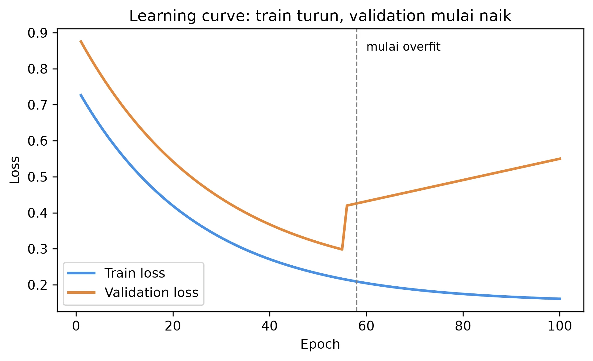

---
title: "Overfitting, Regularisasi dan Evaluasi untuk Data Iklim"
description: "Bab 5 — mendiagnosa dan mencegah overfit (bias-variance, L2, dropout, early stopping), memilih metrik operasional yang tepat (MAE/RMSE/R²/Willmott/KGE dan CSI/FAR/POD/TS), serta cross-validation deret waktu (walk-forward) untuk data iklim."
pubDate: 2026-09-01
categories: ["Deep Learning", "Meteorologi"]
tags: ["overfitting", "regularisasi", "dropout", "cross validation", "walk-forward", "CSI", "FAR", "POD", "evaluasi"]
version: "1.0.0"
bookDOI: "10.5281/zenodo.0000000"
status: draft
chapter: 5
book: "Pengantar Deep Learning untuk Meteorologi"
---

# Bab 5 — Overfitting, Regularisasi dan Evaluasi untuk Data Iklim

> **Prasyarat:** Bab 2 (regresi, MAE/MSE), Bab 3 (klasifikasi, metrik), Bab 4 (pelatihan,
> learning curve, callback). Bab 5 adalah "jembatan" antara kemampuan membangun model dan
> evaluasi yang jujur untuk operasional.

## Tujuan Pembelajaran

Setelah menyelesaikan bab ini, Anda diharapkan mampu:

1. **Mendiagnosa** underfit/overfit melalui learning curve dan konsep bias-variance.
2. **Menerapkan** regularisasi (L2, dropout, early stopping) untuk mencegah overfit.
3. **Memilih** metrik operasional yang tepat (MAE/RMSE/R²/Willmott/KGE dan CSI/FAR/POD/TS)
   sesuai tujuan.
4. **Menerapkan** cross-validation deret waktu yang benar (walk-forward/blocked) dan
   mencegah leakage.

## 5.1 Bias-Variance: Dua Sumber Kesalahan

Setiap model memiliki dua jenis kesalahan struktural:

- **Bias tinggi** — model terlalu sederhana, tidak menangkap pola data (underfit).
  Misal: memakai garis lurus untuk data yang jelas tidak linear.
- **Varians tinggi** — model terlalu sensitif pada data latih; sedikit perubahan data
  mengubah prediksi besar (overfit). Misal: jaringan sangat besar yang "menghafal" noise.

Ini bukan dua "tipe" yang terpisah, melainkan **trade-off**: saat kapasitas model naik,
bias turun tetapi varian naik. Titik keseimbangan terbaik adalah di mana error total
(bias + varian + noise) minimal — dicapai di "titik manis" antara underfit dan overfit.

Analoginya di meteorologi: peramal yang "selalu memprediksi rata-rata klimatologi" punya
**bias tinggi namun varian nol** (tidak pernah meleset besar, tapi selalu kurang tajam).
Peramal yang "selalu memprediksi kondisi tahun lalu persis" bisa sangat akurat untuk data
yang dihafalnya, tetapi **varian tinggi** — memburuk drastis saat kondisi berubah. Kita
ingin peramal yang berada di tengah: mengikuti pola nyata tetapi tidak menghafal kebetulan
tahun lalu.

**Tabel 5.1** — Perbandingan pola underfit, fit baik, dan overfit.

| Aspek | Underfit | Fit baik | Overfit |
|---|---|---|---|
| Kapasitas model | Terlalu kecil | Cukup | Terlalu besar |
| Train error | Tinggi | Rendah | Sangat rendah (mendekati 0) |
| Val/Test error | Tinggi | Rendah | Naik kembali |
| Penyebab umum | Model/fitur/algoritma sederhana | Tuning tepat | Terlalu banyak parameter/epoch |

## 5.2 Mendiagnosa via Learning Curve

Cara paling langsung melihat underfit/overfit: **plot train error vs validation error**
terhadap epoch (sudah dikenalkan Bab 4 §4.7):

- **Underfit:** kedua kurva tinggi & datar — model tidak mampu belajar. Solusi: kapasitas
  lebih besar, fitur lebih baik, LR lebih besar.
- **Overfit:** train terus turun, validation naik setelah titik tertentu. Solusi:
  regularisasi (§5.3), lebih banyak data, lebih sedikit parameter, early stopping.



Gambar 5.1 adalah pola overfit paling umum. Perhatikan titik di mana val mulai naik —
itu sinyal bahwa model mulai menghafal.

Untuk **klasifikasi**, kurva yang sama bisa dipakai dengan loss (cross-entropy); untuk
regresi, dengan MAE/MSE.

### Berapa "jauh" overfit dikatakan buruk?

Tidak ada angka pasti, tetapi indikator umum:

- Jika val error naik **secara konsisten** (bukan fluktuasi kecil) setelah titik tertentu
  → sudah overfit.
- Jika train error mendekati nol sementara val error jauh lebih besar → overfit jelas.
- Bandingkan dengan **baseline** (Bab 2): jika model overfit masih kalah dari baseline
  sederhana di validasi, model itu tidak berguna — buang atau perbaiki.

Kunci: kita menilai pada **validasi** (dan akhirnya test), bukan train. Nilai train yang
luar biasa rendah adalah jebakan umum.

## 5.3 Regularisasi: Mencegah Overfit

Regularisasi adalah teknik yang "menahan" model agar tidak terlalu bebas menghafal data.
Empat teknik utama:

Regularisasi adalah teknik yang "menahan" model agar tidak terlalu bebas menghafal data.
Empat teknik utama:

### 1. Early stopping (sudah dikenal)

Hentikan pelatihan saat validation mulai tidak membaik (Bab 4 §4.6). Paling mudah dan
hampir selalu membantu.

**Kode 5.1 — Early stopping dengan restore best weights.**

```python
import tensorflow as tf

callbacks = [
    tf.keras.callbacks.EarlyStopping(
        monitor="val_loss", patience=15, restore_best_weights=True
    )
]
```

### 2. Regularisasi L2 (weight decay)

Menambahkan penalti ke loss sebanding dengan kuadrat besarnya bobot:

$$ \mathcal{L}_{\text{total}} = \mathcal{L}_{\text{data}} + \lambda \sum_j w_j^2 \tag{5.1} $$

Persamaan (5.1): `λ` (lambda) mengontrol kekuatan penalti. Model "didorong" memakai bobot
kecil, sehingga tidak terlalu bergantung pada satu fitur. Di Keras:

```python
tf.keras.layers.Dense(8, activation="relu", kernel_regularizer=tf.keras.regularizers.l2(1e-4))
```

### 3. Dropout

Selama **pelatihan**, dropout mematikan sebagian neuron secara acak (mis. 20–50%). Ini
memaksa jaringan belajar dengan "banyak versi" model sehingga lebih robust. Saat
**evaluasi**, neuron aktif semua.

```python
tf.keras.layers.Dropout(0.3)
```

**Kode 5.2 — Contoh arsitektur dengan regularisasi (kernel regularizer L2 + dropout).**

```python
model = tf.keras.Sequential([
    tf.keras.layers.Dense(32, activation="relu",
                          kernel_regularizer=tf.keras.regularizers.l2(1e-4), input_shape=(n,)),
    tf.keras.layers.Dropout(0.3),
    tf.keras.layers.Dense(16, activation="relu",
                          kernel_regularizer=tf.keras.regularizers.l2(1e-4)),
    tf.keras.layers.Dropout(0.2),
    tf.keras.layers.Dense(1),
])
```

### 4. Batch Normalization (sekilas)

Menormalkan aktivasi di dalam jaringan agar pelatihan lebih stabil; sering dipakai
bersamaan. Dibahas singkat; paling berguna di jaringan yang lebih dalam (Bab 7).

**Kapan memakai yang mana?**

- Data kecil + overfit ringan → early stopping + L2 ringan.
- Overfit menengah-berat → tambah dropout.
- Underfit → **jangan** tambah regularisasi; perbaiki kapasitas/fitur dulu.

Aturan penting: **jangan** menambah regularisasi hanya karena "model tidak jalan" tanpa
melihat learning curve — bisa memperburuk underfit.

### Bagaimana regularisasi bekerja secara intuitif?

- **L2** "mengecilkan" bobot: model tidak boleh bertumpu besar pada satu fitur, sehingga
  lebih tahan terhadap noise pada fitur tertentu (Persamaan 5.1).
- **Dropout** membuat jaringan belajar dengan "ansambel efektif" dari banyak sub-jaringan
  (neuron acak dimatikan), sehingga tidak ada neuron yang menjadi titik tunggal kegagalan;
  konsep ini diperkenalkan oleh Srivastava et al. (2014) [3].
- **Early stopping** membatasi *berapa lama* model boleh belajar, mencegah model
  "menghafal" cukup dalam untuk menangkap noise.

Ketiganya menyerang arah berbeda dari masalah yang sama: terlalu bebasnya model
menyesuaikan data latih.

### Contoh sederhana efek L2

Bayangkan fitur kelembapan penting untuk hujan. Tanpa L2, model bisa memberi bobot besar
pada kelembapan dan mengabaikan yang lain; dengan L2, bobot besar "dikenai biaya"
(penalti kuadrat) sehingga model lebih menyebar bobotnya. Efeknya: prediksi lebih stabil
saat ada sedikit noise pada pengukuran kelembapan — relevan karena data lapangan selalu
ber-noise.

## 5.4 Memilih Metrik Operasional yang Tepat

Sekarang kita masuk bagian yang paling membedakan buku ini dengan buku ML umum: **metrik
yang benar untuk meteorologi** bergantung pada fenomena dan tujuan.

### Untuk regresi (besaran kontinu)

- **MAE** — galat rata-rata, mudah dipahami (satuan sama). Tahan pencilan.
- **RMSE** — akar MSE; menghukum galat besar lebih. Selalu ≥ MAE; selisihnya menunjukkan
  bobot galat ekstrem.
- **R²** — proporsi varians yang dijelaskan; bisa negatif jika model lebih buruk dari
  rata-rata (kurang informatif di luar range training).
- **Willmott index (d)** — antara 0–1; lebih "ramah" pada data berskala (sering dipakai
  hidrologi/meteo).
- **KGE** (Kling–Gupta efficiency) — menggabungkan korelasi, bias, dan variabilitas;
  populer di hidrologi; dirinci oleh Gupta et al. (2009) [4].

Sebagai referensi dasar evaluasi & praktik model pada umumnya, lihat pula [2].

**Tabel 5.2** — Panduan memilih metrik regresi.

| Situasi | Metrik yang disarankan |
|---|---|
| Melaporkan galat khas ke pengguna umum | MAE |
| Memberi bobot pada galat besar (ekstrem) | RMSE |
| Menilai kesesuaian pola secara luas | R² / KGE |
| Data dengan skala & bias sering dibahas (hidrologi) | KGE / Willmott |
| Standar laporan operasional meteo | MAE + RMSE (keduanya) |

### Untuk klasifikasi / kejadian langka

Bab 3 sudah mengenalkan precision/recall/F1. Di operasional, kuartet klasik peramal:

- **POD** (*probability of detection*) = recall = `TP/(TP+FN)` — "berapa kejadian yang
  tertangkap?".
- **FAR** (*false alarm ratio*) = `FP/(TP+FP)` — "dari yang diumumkan, berapa yang
  meleset?".
- **CSI** (*critical success index*) = `TP/(TP+FP+FN)` — "skor sukses", menghukum baik
  miss maupun false alarm.
- **TS** mengacu pada *threat score* — sama dengan CSI.

**Tabel 5.3** — Kuartet verifikasi klasik WMO.

| Metrik | Formula | Pertanyaan | Target |
|---|---|---|---|
| POD | TP/(TP+FN) | Kejadian tertangkap? | tinggi |
| FAR | FP/(TP+FP) | Banyak false alarm? | rendah |
| CSI/TS | TP/(TP+FP+FN) | Skor sukses keseluruhan | tinggi |
| (Bias score) | (TP+FP)/(TP+FN) | Model terlalu sering/malas prediksi? | ~1 |

Pedoman resmi: WMO *Guidelines on the Verification of Operational Forecasts* [1].

**Mengapa ini penting?** Data kejadian langka (hujan deras, gelombang tinggi, badai)
membuat akurasi menyesatkan (Bab 3). CSI/POD/FAR memberi gambaran yang jujur tentang
**nilai operasional** model, bukan sekadar "benar berapa persen".

### Numerik singkat: beda cerita antar metrik

Ambil kasus: dari 100 hari, 10 hari benar-benar hujan deras. Model A dan B:

| | TP | FP | FN | Akurasi | POD | FAR | CSI |
|---|---|---|---|---|---|---|---|
| Model A | 8 | 2 | 2 | 96% | 0.80 | 0.20 | 0.67 |
| Model B | 3 | 0 | 7 | 93% | 0.30 | 0.00 | 0.30 |

**Tabel 5.4** — Dua model, cerita yang sangat berbeda.

Model A berakurasi 96% dan POD 0.80 — tangkapannya bagus, tapi 20% peringatan salah
(FAR). Model B tidak pernah salah beri peringatan (FAR 0) — tapi melewatkan 7 dari 10
kejadian (POD 0.30). CSI mengungkap yang sebenarnya: keduanya tidak hebat, dan **tujuan
operasional** yang menentukan mana yang lebih diterima (peringatan dini → Model A; biaya
evakuasi mahal → Model B). Ini persis alasan kita tidak bisa berhenti di akurasi.

## 5.5 Cross-Validation untuk Deret Waktu: Walk-Forward

Cross-validation (bagi-train-val-test berulang) untuk data **independen identik** memakai
k-fold acak. Data **deret waktu** tidak independen: nilai berdekatan berkorelasi, dan
penggunaan masa depan saat latih = leakage (Bab 2 §2.7).

Solusinya: **walk-forward validation** (juga disebut *forward chaining* atau *expanding
window*), yang mensimulasikan penggunaan operasional:

1. Mulai dengan windows latih di awal deret.
2. Prediksi window berikutnya (utk validasi).
3. Geser batas latih maju; ulangi.

**Tabel 5.5** — Skema walk-forward (ilustrasi 5 fold).

| Fold | Train | Validate | (24 langkah) |
|---|---|---|---|
| 1 | t1–t100 | t101–t120 | |
| 2 | t1–t120 | t121–t140 | |
| 3 | t1–t140 | t141–t160 | |
| 4 | t1–t160 | t161–t180 | |
| 5 | t1–t180 | t181–t200 | |

Pada Tabel 5.4, latih selalu **hanya masa lalu**; validasi selalu **di depan** batas latih.
Ini mereplikasi kondisi nyata: saat model dipakai, ia hanya tahu data hingga hari ini.

**Kode 5.3 — Contoh walk-forward sederhana (pseudo; lengkap di notebook).**

```python
horizon = 20
results = []
for start in range(0, len(X) - horizon, 20):
    i_end = start + 100          # contoh: latih 100 langkah dari posisi awal
    Xtr_fold, ytr_fold = X[start:i_end], y[start:i_end]
    Xva_fold, yva_fold = X[i_end:i_end+horizon], y[i_end:i_end+horizon]
    model = build_model()        # model baru tiap fold (jujur)
    model.fit(Xtr_fold, ytr_fold, epochs=60, batch_size=32, verbose=0)
    results.append(mae(yva_fold, model.predict(Xva_fold, verbose=0)))
print("Rata-rata MAE walk-forward:", round(sum(results)/len(results), 4))
```

Penting: **latih model baru di tiap fold** — jika Anda melatih sekali & memprediksi semua
fold, informasi masa depan bocor.

### Kenapa bukan "k-fold acak" untuk data iklim?

Data cuaca menunjukkan **autokorelasi** (nilai hari ini mirip hari kemarin). K-fold acak
menempatkan sampel berdekatan di train dan test, sehingga evaluasi "menyontek" dari
ketetanggaan. Studi kasus Bab 8–9 akan memperlihatkan betapa besar perbedaannya: model
yang tampak hebat pada k-fold acak bisa gagal total pada walk-forward — persis perilaku
yang akan dialami di produksi.

### k-fold (blocked) sebagai alternatif

Jika dataset panjang dan Anda butuh lebih banyak fold, pakai **blocked/rolling k-fold**:
potong deret menjadi blok berurutan, lalu untuk tiap fold latih blok-blok sebelum fold
validasi tersebut (tanpa melihat masa depan). Ini "saudara" walk-forward dengan jumlah
fold tetap. Intinya tetap sama: **validasi selalu mengikuti waktu**, bukan kebalikannya.

## 5.6 Menerapkan Evaluasi: Alur Lengkap

### Kapan memakai k-fold acak masih ok?

Hanya jika data Anda benar-benar *i.i.d.* (misal koleksi gambar cuaca independen). Untuk
deret waktu stasiun, pasang surut, atau hujan — **selalu** walk-forward/blocked. Ini
aturan yang akan dipakai keras di Bab 8–9.

## 5.6 Menerapkan Evaluasi: Alur Lengkap

Untuk menutup Bab 5, rangkum evaluasi yang jujur dalam urutan:

1. **Split** (bab 2): train / val / test berbasis waktu; test hanya dipakai sekali.
2. **Baseline** (bab 1–2): ukur model sederhana (persistence, klimatologi, linear) dulu.
3. **Latih & pantau** (bab 4): learning curve; early stopping saat val berhenti membaik.
4. **Diagnosa** (bab 5): overfit? → regularisasi; underfit? → kapasitas/fitur.
5. **Evaluasi** (bab 5): regresi → MAE/RMSE/R²/RMSE/KGE; kejadian → CSI/POD/FAR + threshold.
6. **Validasi temporal** (bab 5): walk-forward untuk mengukur generalisasi seiring waktu.
7. **Lapor** (bab 10): angka + satuan + threshold + keterbatasan, banding dengan baseline.

Langkah 5–6 adalah "izin keluar" sebelum klaim apa pun: jangan pernah melaporkan
"prediksi akurat 97%" tanpa metrik yang sesuai konteks (KGE/CSI, bukan akurasi dangkal).

## 5.7 Latihan

**Soal konsep**

1. Jelaskan bias-variance trade-off dengan analogi meteorologi.
2. Bagaimana learning curve membantu memutuskan apakah menambah dropout atau mengurangi
   kapasitas?
3. Mengapa RMSE ≥ MAE selalu? Apa implikasi untuk data hujan ekstrem?
4. Kapan memakai R² vs KGE? Jelaskan kelemahan R² pada data di luar range training.

**Latihan praktik (notebook `ch-05-04_metrik_walkforward.ipynb`)**

5. Ambil model klasifikasi Bab 3; evaluasi dengan POD/FAR/CSI di beberapa threshold.
   Buat tabel ringkasnya.
6. Bangun model regresi Bab 2; hitung MAE, RMSE, R², Willmott d, dan KGE (gunakan
   fungsi sederhana). Diskusikan perbedaan cerita tiap metrik.
7. Terapkan regularisasi (L2 + dropout) pada model yang overfit; bandingkan learning
   curve sebelum/sesudah.
8. Terapkan walk-forward (fold) pada data pasang surut Bab 2 dan bandingkan MAE rata-rata
   dengan split tunggal.
9. (Proyek mini) Tulis fungsi evaluasi reusabel: input (y_true, y_pred) → output
   MAE/RMSE/R²/KGE atau POD/FAR/CSI. Simpan untuk Bab 8–9.

## Ringkasan

- Overfit = varian tinggi (menghafal data latih); underfit = bias tinggi (terlalu sederhana).
- Learning curve adalah alat diagnosis utama (train vs val).
- Regularisasi: early stopping, L2, dropout — terapkan berdasarkan diagnosis, bukan asal.
- Metrik regresi: MAE/RMSE/R²/Willmott/KGE; metrik kejadian langka: CSI/POD/FAR (WMO).
- Cross-validation deret waktu: walk-forward (bukan k-fold acak) — jujur & anti-leakage.
- Bab 8–9 akan memakai semua ini pada studi kasus nyata.

## References

1. World Meteorological Organization, "WMO guidelines on the verification of operational
   forecasts," WMO, Geneva, Switzerland, 2018.
2. I. Goodfellow, Y. Bengio, and A. Courville, *Deep Learning*. Cambridge, MA, USA:
   MIT Press, 2016.
3. N. Srivastava, G. Hinton, A. Krizhevsky, I. Sutskever, and R. Salakhutdinov, "Dropout:
   A simple way to prevent neural networks from overfitting," *J. Mach. Learn. Res.*,
   vol. 15, no. 1, pp. 1929–1958, 2014.
4. H. V. Gupta, H. Kling, K. K. Yilmaz, and G. F. Martinez, "Decomposition of the mean
   squared error and NSE performance criteria: Implications for improving hydrological
   modelling," *J. Hydrol.*, vol. 377, no. 1–2, pp. 80–91, 2009, doi: 10.1016/j.jhydrol.2009.08.003.