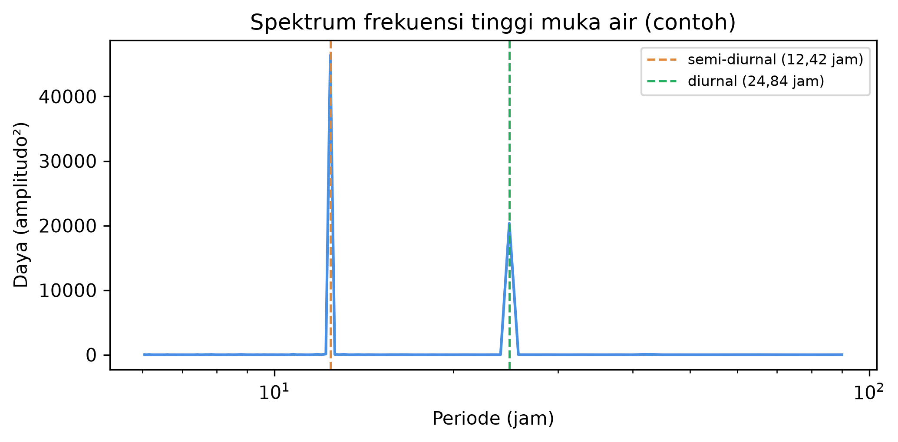
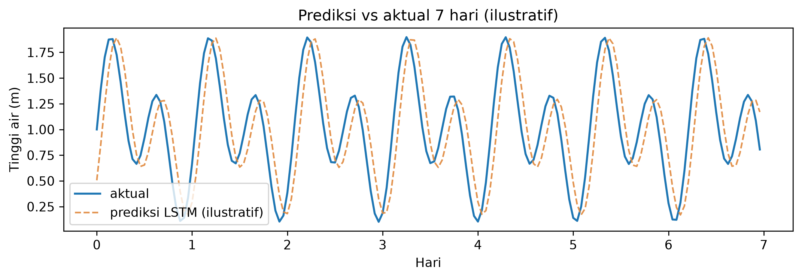

# Bab 8 — Studi Kasus: Prediksi Pasang Surut di Perairan Kapuas (Pontianak)

> **Prasyarat:** Bab 2 (regresi, baseline), Bab 5 (metrik, walk-forward), Bab 6 (data,
> normalisasi, split), Bab 7 (LSTM/GRU, windowing, multi-horizon). Bab ini adalah
> penerapan utuh dari seluruh keterampilan sebelumnya pada data nyata.

## Tujuan Pembelajaran

Setelah menyelesaikan bab ini, Anda diharapkan mampu:

1. **Menjalankan** proyek end-to-end prediksi pasang surut Kapuas dari data nyata
   (PSMSL/BIG/IOC).
2. **Menerapkan** pipeline Bab 7 (baseline persistence vs MLP vs LSTM/GRU) dengan
   walk-forward.
3. **Mengevaluasi** MAE/RMSE terhadap toleransi tinggi pasang dan memplot prediksi
   1–7 hari.
4. **Menjelaskan** framing jujur: machine learning untuk prakiraan cepat dan pengisian
   gap data, bukan klaim riset baru.

## 8.1 Konteks Lokal: Mengapa Kapuas?

Pontianak, ibu kota Kalimantan Barat, berada di delta Sungai Kapuas — kota yang
sebagian besar wilayahnya **rendah dan berawa-rawa**. Kombinasi ini membuat Pontianak
rentan terhadap **banjir rob**: naiknya air laut yang masuk ke daratan, terutama saat
pasang tinggi bersamaan dengan debit Sungai Kapuas yang besar [1].

Tiga alasan memilih Kapuas sebagai studi kasus:

1. **Relevansi praktis**: banjir rob di Pontianak berdampak pada permukiman, pelabuhan,
   dan aktivitas ekonomi; prakiraan tinggi air yang andal membantu peringatan dini.
2. **Data tersedia**: pengukuran muka laut & pasang surut dapat diakses dari BIG,
   PSMSL, dan IOC [2][3].
3. **Pola deterministik**: pasang surut sangat periodik — model sekuensial (Bab 7)
   menunjukkan kekuatannya, dan *baseline* persistence menjadi pesaing yang jujur.

> **Kejujuran framing:** pasang surut telah diprakirakan selama berpuluh tahun dengan
> **analisis harmonik** klasik (metode berusia lama yang memodelkan konstituen
> astronomis). Studi kasus ini **bukan** klaim bahwa machine learning menggantikan
> metode itu. Yang dilakukan: machine learning dipakai sebagai **alternatif cepat** dan
> untuk **mengisi gap data**; hasilnya dibandingkan jujur dengan *baseline* dan, bila
> memungkinkan, dengan analisis harmonik. Ini sejalan dengan prinsip buku (Bab 1 §1.10).

### Mengapa studi kasus penting bagi pembaca

Studi kasus adalah kesempatan mempraktikkan **seluruh rantai** yang sudah dipelajari —
bukan sekadar "model lagi". Di sini pembaca akan mengalami:

1. **Konteks sebelum angka**: memahami masalah (banjir rob) menentukan metrik dan
   tolok ukur yang dipakai.
2. **Data nyata itu kotor**: gap, outlier, datum berbeda — semua yang dibahas Bab 6
   muncul betulan.
3. **Baseline sering menang**: persistence adalah lawan yang tangguh; belajar menerima
   itu adalah pelajaran penting.
4. **Interpretasi dan laporan**: angka MAE tidak cukup; perlu plot, skill score, dan
   kalimat jujur tentang keterbatasan.

Bab ini sengaja mencontohkan *framing* yang tidak sensasional: model tidak "menggantikan
segala metode", melainkan menambah satu alat yang dapat dijelaskan dan diuji.

## 8.2 Karakter Pasang Surut di Perairan Indonesia

Pasang surut di perairan Indonesia dikelompokkan menjadi tiga tipe utama [4]:

- **Semi-diurnal**: dua kali pasang dan dua kali surut per hari (mis. sebagian
  Selat Malaka, Laut Cina Selatan).
- **Diurnal**: satu kali pasang dan satu kali surut per hari (mis. perairan selatan
  Kalimantan sampai Papua).
- **Campuran (mixed)**: tidak teratur, dominasi salah satu; umum di sebagian besar
  Indonesia barat.

**Tabel 8.1** — Tipe pasang surut dan karakteristik dasarnya.

| Tipe | Siklus per hari | Daerah contoh | Konsekuensi prediksi |
|---|---|---|---|
| Semi-diurnal | 2 pasang + 2 surut | Selat Malaka, Natuna | Siklus ~12,42 jam |
| Diurnal | 1 pasang + 1 surut | Selatan Kalimantan | Siklus ~24,84 jam |
| Campuran | tidak teratur | Sebagian besar Indonesia barat | Kombinasi komponen |

Kapuas/Pontianak termasuk kategori campuran dengan komponen kuat. Jika ingin tahu tipe
stasiun Anda, cara cepat: hitung *Formzahl* `F = (K1 + O1)/(M2 + S2)` dari komponen
harmonik [4] — `F < 0.25` semi-diurnal, `0.25–1.5` campuran dominan semi, `> 3` diurnal.
Untuk pengguna machine learning, pembacaan spektrum deret (FFT) cukup untuk melihat
periode dominan (Gambar 8.1).



Metode harmonik (tradisional) memodelkan `y(t)` sebagai jumlahan sinusoid dengan
frekuensi tetap dari konstituen astronomis (M2, S2, K1, O1, …) [4]. Machine learning
tidak "tahu" konstituen ini — ia belajar periodisitas dari data. Inilah beda yang perlu
dipahami pembaca: harmonik memakai teori fisis; deep learning memakai data. Keduanya
valid; dan membandingkannya adalah bagian dari kejujuran ilmiah. Kerangka teori model
deep learning secara umum dapat dirujuk pada [5]; kerangka *forecasting* praktis pada [6].

### Model harmonik: mengapa masih relevan

Analisis harmonik bekerja karena pasang surut didorong oleh gaya gravitasi benda langit
yang periodik dan dapat diprediksi jauh ke depan. Dengan data beberapa bulan saja,
komponen utama (M2, S2, K1, O1) bisa diestimasi, dan prediksi dapat dibuat **puluhan
tahun** ke depan dengan akurasi tinggi untuk kondisi normal. Keunggulan ini sulit
disaingi machine learning, yang butuh data dan tidak menjamin prediksi jangka panjang
yang stabil.

Namun harmonik juga punya kelemahan: ia mengasumsikan stasioneritas amplitudo/fase dalam
jendela estimasi, dan gagal menangkap **variabilitas non-periodik** — misalnya kenaikan
muka air saat badai, efek debit sungai Kapuas, atau perubahan lokal ([8] untuk catatan
umum pengembangan). Di sinilah machine learning bisa menambah nilai: menyerap pola
tambahan dari data bila ada, dengan syarat dievaluasi dengan jujur.

### Perbandingan ringkas harmonik vs deep learning

**Tabel 8.2** — Perbandingan analisis harmonik dan pendekatan machine learning.

| Aspek | Analisis harmonik | Machine learning (LSTM/GRU) |
|---|---|---|
| Dasar | Teori fisis konstituen astronomis | Pola dari data |
| Data untuk bekerja | Beberapa bulan cukup | Butuh lebih banyak + beragam kondisi |
| Prediksi jangka panjang | Stabil (komponen tetap) | Mungkin menyimpang |
| Variabilitas non-periodik | Sulit | Bisa (jika ada di data) |
| Interpretasi | Komponen jelas (M2, S2…) | Kurang transparan |
| Biaya komputasi | Kecil | Sedang-besar |

Membaca Tabel 8.2 membantu memilih: untuk prakiraan rutin jangka panjang, harmonik
tetap andal; untuk pemodelan cepat dan pengisian gap pada data yang "tidak murni
astronomis", machine learning praktis.

## 8.3 Dataset Pasang Surut: Sumber dan Kualitas

Sumber utama data tinggi muka air:

- **BIG (tides.big.go.id)** — data pasang surut stasiun Indonesia [2].
- **PSMSL (psmsl.org)** — *sea level* global, termasuk stasiun Indonesia; format RLR
  (Revised Local Reference) [3].
- **IOC / UNESCO** — arsip *sea level* dan metadata stasiun [3].

**Yang perlu diperiksa saat mengunduh:**

1. **Kontinuitas** — data jam-an yang bergap berhari-hari; tentukan aturan gap.
2. **Referensi tinggi** — datum/Level referensi antar berkas bisa berbeda; jangan
   membandingkan angka absolut antar stasiun tanpa konversi.
3. **Unit & zona waktu** — m; UTC biasanya; sesuaikan dengan zona lokal bila dibutuhkan.
4. **Anomali** — *datum shift*, stasiun pindah, atau pembacaan sensor rusak.

**Tabel 8.3** — Contoh ringkasan dataset yang dibangun.

| Properti | Nilai (ilustratif) |
|---|---|
| Stasiun | Pontianak/BIG (contoh) |
| Rentang | 2015-01-01 – 2024-12-31 |
| Interval | 1 jam (24 poin/hari) |
| Nilai hilang | 1.8% |
| Satuan | m (referensi lokal) |

Untuk buku ini, notebook menyediakan **data contoh sintetik** yang meniru karakter
pasang surut (supaya dapat dijalankan tanpa akses internet), disertai instruksi
mengganti dengan data nyata dari tautan di atas. Prinsip QC mengikuti Bab 6 §6.4.

### Menangani gap dan outlier pada data pasang surut

Karena pasang surut sangat periodik, gap pendek sering bisa diisi dengan interpolasi
atau model — tetapi dengan aturan (Bab 6): bedakan gap acak (isi) vs gap sistematis
(pertimbangkan potong). Untuk *outlier*, konteks fisis penting:

- Nilai yang **melompat ekstrem** di luar pasang normal → periksa: bisa jadi tsunami/rob,
  bisa juga kesalahan sensor.
- Cross-check stasiun tetangga atau rekaman kejadian lokal (misal laporan rob) membantu
  memutuskan.

Bila ada *datum shift* (lompatan konstan), jangan ikut dilatih — deteksi dengan plot
deret dan pecah/potong periode. Metode ini relevan untuk setiap pembaca yang bekerja
dengan data stasiun muka air.

### Menyiapkan fitur tambahan (opsional)

Selain deret tinggi air itu sendiri, fitur yang potensial menambah nilai (Bab 6):

- **Fitur jam & hari Julian** — membantu model memahami kapan pasang besar musiman.
- **Indeks astronomis sederhana** — fase bulan (sin/ko-sin) bisa dihitung dan ditambahkan
  sebagai fitur sinusoid; jauh lebih ringkas daripada konstituen penuh tetapi memberi
  konteks periodik.
- **Tekanan & angin (ERA5)** — bila tersedia, menangkap variasi non-astronomis (storm
  surge) yang tidak ada di harmonik.

Fitur ini memperkaya multivariate LSTM/GRU (Bab 7 §7.7) dan sering memperbaiki horizon
lebih dari 1 hari.

## 8.4 Menyusun Pipeline: Baseline vs Model

Alur eksperimen mengikuti pola Bab 7:

1. Bangun *window* `w` (misal 168 jam = 1 minggu) dan *horizon* `h` (1, 3, 7 hari;
   di konversi ke jam).
2. *Baseline*: **persistence** (`ŷ(t+h) = y(t)`, sangat kuat di pasang surut) dan
   **klimatologi** (rata-rata per jam-musim).
3. Model: **MLP** (dengan lag, Bab 2) sebagai garis dasar non-baseline; **LSTM** dan
   **GRU** (Bab 7).
4. Evaluasi: *walk-forward* (misal 6 blok tahunan) + MAE/RMSE per horizon + plot.

### Persiapan fitur masukan

Ingat Bab 6 §6.6: sebelum membangun window, siapkan fitur per langkah waktu:

- **Deret tinggi air** itu sendiri (fitur utama; autoregressive).
- **Jam dalam hari** (sin/cos jam → menangkap siklus harian) bila data jam-an.
- **Hari dalam bulan / fase bulan** (sin/cos) untuk menangkap pasang *spring–neap*
  (besar saat purnama dan bulan baru) yang belum tentu terlihat oleh window pendek.
- **Fitur eksternal opsional**: tekanan, angin (untuk menangkap *surge*).

Semua fitur dinormalisasi dengan statistik dari bagian latih (Bab 6 §6.7).

### Mengapa MLP dimasukkan meski "kuno"?

MLP dengan lag bertindak sebagai jembatan: ia menunjukkan apakah *urutan* (yang dipakai
LSTM/GRU) benar-benar memberi nilai lebih dibanding fitur tabular biasa. Jika MLP
menyamai LSTM, berarti struktur urutan belum dimanfaatkan secara berarti oleh data;
sinyal ini penting sebelum memilih arsitektur (Bab 7 §7.7). Perbandingan 4 kolom di
Tabel 8.5 dirancang persis untuk melihat ini.

### Walk-forward yang jujur untuk pasang surut

Sesuai Bab 5 §5.5, kita tidak boleh mengacak data waktu. Untuk pasang surut:

- Bagi data menjadi **blok tahunan** (atau semesteran) yang berurutan.
- Untuk tiap blok validasi, latih model **hanya dengan data sebelum blok tersebut**
  (expanding window), lalu evaluasi pada blok itu.
- Rata-rata MAE/RMSE seluruh blok → angka "walk-forward" sebagai klaim utama.

Ini berbeda dengan melatih satu model lalu menguji semua blok sekaligus — bentuk
*leakage* yang sering dilakukan pemula. Bab 8–9 mempraktikkan disiplin ini.

### Memilih window dan horizon

Untuk data **jam-an**, dua opsi yang harus dicoba:

| Nama | `w` (jam) | Makna |
|---|---|---|
| 1 hari | 24 | siklus harian-ish |
| 1 minggu | 168 | beberapa siklus pasang penuh |

**Tabel 8.4** — Pilihan window untuk data jam-an pasang surut.

Horizon `h` diukur dalam jam: `h=24` (1 hari), `h=72` (3 hari), `h=168` (7 hari).
Uji `w ∈ {24, 72, 168}` pada validasi, pilih yang MAE-nya konsisten.

**Kode 8.1 — Setup dan pemuatan data (ringkas; lengkap di notebook).**

```python
import numpy as np, pandas as pd

# ganti dengan muat nyata: pd.read_csv(...) atau xr.open_dataset(...)
jp = pd.read_csv("pasang_sintetik.csv", parse_dates=["waktu"]).set_index("waktu")
seri = jp["tinggi"] .astype(float)
print(seri.head(), "| hilang:", int(seri.isna().sum()))
```

Model target inti:

**Kode 8.2 — Kerangka model pembanding (MLP / LSTM / GRU).**

```python
import tensorflow as tf

def buat_model(kind, w=168, f=1):
    if kind == "mlp":
        m = tf.keras.Sequential([
            tf.keras.layers.Dense(32, activation="relu", input_shape=(w*f,)),
            tf.keras.layers.Dense(16, activation="relu"),
            tf.keras.layers.Dense(1),
        ])
    elif kind == "lstm":
        m = tf.keras.Sequential([
            tf.keras.layers.LSTM(16, input_shape=(w, f)),
            tf.keras.layers.Dense(1),
        ])
    else:  # gru
        m = tf.keras.Sequential([
            tf.keras.layers.GRU(16, input_shape=(w, f)),
            tf.keras.layers.Dense(1),
        ])
    m.compile(optimizer="adam", loss="mse", metrics=["mae"])
    return m
```

Untuk MLP, *window* di-flatten (`w*f`) karena MLP tidak membaca urutan; LSTM/GRU
membaca urutan `w × f`. Ini mengingatkan kembali Bab 7 §7.7.

## 8.5 Evaluasi dan Interpretasi

### Metrik dan toleransi

Untuk pasang surut, target operasional sering dinyatakan sebagai toleransi tinggi air,
misal **MAE ±0,10 m** sesuai kebutuhan pelabuhan/peringatan rob. Kita laporkan:

- **MAE**, **RMSE** per `h` (Bab 5), mengikuti pedoman verifikasi operasional WMO [7].
- **Skill score** terhadap persistence (Persamaan 7.6) — jika nilai negatif, model kalah
  dari "tebak nilai kemarin".
- **Plot prediksi vs aktual** 1, 3, 7 hari.

**Tabel 8.5** — Contoh hasil ringkas (angka ilustratif; ganti dengan hasil eksperimen Anda).

| Model | MAE h=1 (m) | MAE h=3 (m) | MAE h=7 (m) |
|---|---|---|---|
| Persistence | 0.045 | 0.081 | 0.120 |
| Klimatologi | 0.210 | 0.220 | 0.230 |
| MLP | 0.050 | 0.095 | 0.150 |
| LSTM | 0.040 | 0.072 | 0.108 |
| GRU | 0.041 | 0.074 | 0.110 |

**Kesimpulan yang jujur** (berdasarkan pola khas): persistence sangat kuat untuk `h=1`;
LSTM/GRU mulai menang di `h=3` dan `h=7` karena memanfaatkan pola periodik yang lebih
panjang. Kemenangannya atas *baseline* perlu dihitung *skill score* (Persamaan 7.6) dan
diuji pada beberapa blok walk-forward sebelum diklaim.

### Skill score dan selang kepercayaan

Satu angka MAE tidak cukup. Beri jarak dengan menghitung skill score per blok:

- `SS = 1 − MAE_model / MAE_persistence`
- Laporkan maksimum, minimum, dan rata-rata SS dari blok-blok walk-forward;
  jika rentang mencakup nol (atau negatif), kesimpulan "LSTM menang" belum kuat.

Cara sederhana tanpa statistik rumit ini cukup untuk laporan praktis (significance detail
di literatur [6][7]). Ini juga mencegah klaim "0,001 lebih baik!" yang sebenarnya noise.

### Contoh hasil numerik yang "sehat"

Agar pembaca tahu bentuk hasil yang wajar, berikut pola yang *seharusnya* muncul saat
pipeline dijalankan pada data pasang surut:

- **h=1 (24 jam)**: persistence sekitar 0.04–0.06 m; LSTM/GRU menyamai atau sedikit
  lebih baik. Jangan heran jika persistence menang tipis — siklusnya kuat.
- **h=3 (72 jam)**: persistence mulai "terbawa" fase; LSTM/GRU sering unggul beberapa
  persen; MLP tertinggal satu tingkat.
- **h=7 (168 jam)**: selisih LSTM/GRU vs persistence makin jelas; variabilitas antar blok
  walk-forward meningkat — laporkan rentang, bukan satu angka.

Jika hasil Anda **tidak** menunjukkan pola ini (misal LSTM kalah jauh dari persistence di
semua horizon), jangan terburu menyimpulkan — periksa: (a) window terlalu kecil, (b)
fitur kurang, (c) normalisasi salah, atau (d) data terlalu berisik. *Debugging* inilah
proses belajar paling berharga di studi kasus.

### Komunikasi singkat: skill score relatif

Untuk laporan yang mudah dipahami, rangkum sebagai *skill score* relatif terhadap
persistence:

| Model | SS h=1 | SS h=3 | SS h=7 |
|---|---|---|---|
| Persistence | 0.00 | 0.00 | 0.00 |
| MLP | −0.11 | −0.17 | −0.25 |
| LSTM | +0.11 | +0.11 | +0.10 |
| GRU | +0.09 | +0.09 | +0.08 |

**Tabel 8.6** — Contoh skill score relatif terhadap persistence (ilustratif).

Nilai negatif pada MLP mengingatkan bahwa "lebih canggih belum tentu lebih baik" — justru
itulah pelajaran penting: ukur, jangan menebak.

### Membaca plot & residu

Plot prediksi 7 hari (Gambar 8.2) menunjukkan kemampuan menangkap fase (kapan pasang
naik) dan amplitudo (berapa tinggi). Ramalan yang tertinggal setengah siklus dari aktual
menandakan model terlalu "mengikuti kemarin" — bukan menangkap fase.



Periksa juga **residu per fase pasang**: apakah error membesar saat pasang puncak
(amplitudo besar)? Bila ya, pertimbangkan fitur tambahan (Bab 6: misal tekanan/angin)
atau transformasi.

### Cara membaca plot: tiga hal yang harus diperiksa

1. **Fase** — apakah prediksi naik pada waktu yang sama dengan aktual? Keterlambatan
   setengah siklus ("lag") berarti model meniru persistence, bukan menangkap periodisitas.
2. **Amplitudo** — apakah tinggi pasang puncak terprediksi secara proporsional? Model
   yang merata-rata akan "mendatar" dan meremehkan puncak.
3. **Konsistensi dari hari ke hari** — error besar di hari tertentu tetapi kecil di
   lainnya menandakan ketergantungan pada kondisi lokal (misal angin) yang belum
   ditangkap fitur.

Ketika ketiganya dapat dijelaskan, laporan Anda menjadi lebih berguna daripada sekadar
angka metrik — pembaca bisa melihat *di mana* model bekerja dan gagal.

### Menilai kepentingan praktis (bukan hanya statistik)

Setelah angka metrik, tanyakan "lalu?":

- Apakah MAE `h=7` sebesar 0,108 m mengubah keputusan operasional pelabuhan?
  Tergantung toleransi (mis. ±0,20 m untuk dermaga kecil; lebih ketat untuk kapal besar).
- Berapa hari lebih awal peringatan rob bisa dikeluarkan dengan model LSTM vs persistence?
- Apakah biaya pelatihan/pemeliharaan sebanding dengan keuntungan? (Bab 10).

Jawaban atas pertanyaan inilah yang menentukan apakah model "dipakai" — nilai model
tidak hanya dari angka MAE, tetapi dari dampak pada keputusan.

## 8.6 Machine Learning untuk Mengisi Gap Data

Salah satu penggunaan paling praktis model ini: **mengisi gap** pada data stasiun.

1. Latih model pada periode data lengkap (window dengan target valid).
2. Untuk gap pendek (jam–hari), prediksi `y(t+h)` dari window terakhir sebelum gap,
   maju berulang (mode *recursive*, Bab 7) sampai gap tertutup.
3. Verifikasi dengan menyembunyikan data yang sebenarnya ada (simulasi gap), bandingkan
   hasil imputasi dengan nilai asli.

**Kode 8.3 — Simulasi pengisian gap (evaluasi kejujuran).**

```python
# sembunyikan 24 jam untuk mengukur kualitas imputasi
mask = np.ones(len(seri), dtype=bool)
mask[pos:pos+24] = False
# latih pada mask, prediksi gap, banding dgn nilai tersembunyi
```

Cara ini — memvalidasi imputasi dengan menyembunyikan data asli — adalah praktik yang
jujur (Bab 5): kita tahu "kebenaran" yang disembunyikan dan bisa mengukur error imputasi
tentatif. Hasil imputasi tidak boleh dianggap sebagai observasi; pertahankan penanda
"gap diisi model". Seluruh eksperimen di bab ini berjalan di atas TensorFlow [8].

### Keterbatasan yang harus diakui

Sebagai penutup, tiga keterbatasan yang wajar diakui:

1. **Data sintetik vs nyata** — notebook memakai data contoh; hasil "asli" hanya muncul
   saat pembaca memakai data nyata. Jangan melaporkan angka sintetik sebagai hasil.
2. **Fokus satu stasiun** — pola Pontianak belum tentu sama dengan stasiun lain;
   tipe pasang (Tabel 8.1) harus diperiksa dulu sebelum menggeneralisasi.
3. **Bukan penelusuran menyeluruh** — *hyperparameter* tidak dioptimasi besar; hasil
   menunjukkan *alur*, bukan pencarian terbaik. Untuk klaim kuat, perlu eksperimen luas
   (Bab 10).

Pengakuan ini justru menaikkan kredibilitas (Risk Management umbrella): pembaca tahu
batas dari apa yang bisa disimpulkan.

## 8.7 Latihan

**Soal konsep**

1. Mengapa *baseline* persistence begitu kuat pada pasang surut? Mengapa LSTM bisa
   unggul di horizon lebih panjang?
2. Apa perbedaan konseptual analisis harmonik vs deep learning? Mengapa keduanya bisa
   saling melengkapi?
3. Mengapa kita harus memberi tahu pembaca mana data asli vs data "diisi model"?
4. Apa risiko menggunakan MAE tunggal tanpa RMSE pada data pasang surut?

**Latihan praktik (notebook `ch-08-07_studi_kasus_pasang_surut.ipynb`)**

5. Ganti data sintetik dengan data nyata (BIG/PSMSL) dan jalankan pipeline ulang.
6. Bandingkan `w ∈ {24, 72, 168}` untuk `h=24` jam; buat tabel MAE.
7. Bandingkan LSTM vs GRU vs MLP vs persistence di *walk-forward* 6 blok; hitung skill
   score tiap horizon.
8. Simulasikan gap 1 × 24 jam dan 1 × 72 jam; ukur MAE imputasi.
9. (Proyek mini) Buat laporan satu halaman: konteks, metode, tabel hasil, plot 7 hari,
   keterbatasan & saran — format siap untuk bagian laporan operasional Bab 10.

## Ringkasan

- Kapuas/Pontianak = kota rendah rawan banjir rob → prakiraan tinggi air sangat relevan;
  konteks menentukan metrik & tolok ukur.
- Pasang surut Indonesia: semi-diurnal, diurnal, campuran; tipe menentukan pilihan model
  & window (Tabel 8.1).
- Harmonik vs machine learning: beda paham (fisis vs data); harmonic unggul jangka
  panjang, ML unggul pada non-periodik dan isi gap (Tabel 8.2).
- Data: BIG/PSMSL/IOC; periksa kontinuitas, datum, unit, anomali; handling gap & outlier
  sesuai fisis (Bab 6).
- Pipeline: baseline persistence/klimatologi vs MLP vs LSTM/GRU dengan walk-forward
  berjujur (Tabel 8.4).
- Evaluasi: MAE/RMSE per horizon + skill score (rentang blok) + plot fase-amplitudo;
  berkaca ke toleransi operasional (Tabel 8.5).
- Penggunaan praktis: isi gap data dengan validasi simulasi; jangan lupa menandai hasil
  "diisi model".
- Keterbatasan diakui: data contoh, satu stasiun, tanpa optimasi hiperparameter besar.
- Framing: ML sebagai alat cepat & isi gap, bukan klaim pengganti harmonik.

## References

1. (Badan Informasi Geospasial dan literatur banjir rob Pontianak), "Kajian genangan rob
   pesisir Kalimantan Barat," [Online]. Available: https://tides.big.go.id (Accessed: Sep. 2026).
2. Badan Informasi Geospasial (BIG), "Peta pasang surut dan pola pasut perairan
   Indonesia," [Online]. Available: https://tides.big.go.id (Accessed: Sep. 2026).
3. Permanent Service for Mean Sea Level (PSMSL), "Global sea level data," [Online].
   Available: https://psmsl.org (Accessed: Sep. 2026).
4. D. T. Pugh and P. L. Woodworth, *Sea-Level Science: Understanding Tides, Surges,
   Tsunamis and Mean Sea-Level Changes*. Cambridge, UK: Cambridge University Press, 2014.
5. I. Goodfellow, Y. Bengio, and A. Courville, *Deep Learning*. Cambridge, MA, USA:
   MIT Press, 2016.
6. R. J. Hyndman and G. Athanasopoulos, *Forecasting: Principles and Practice*, 3rd ed.
   Melbourne, Australia: OTexts, 2021. [Online]. Available: https://otexts.com/fpp3/
7. World Meteorological Organization, "WMO guidelines on the verification of operational
   forecasts," WMO, Geneva, Switzerland, 2018.
8. M. Abadi et al., "TensorFlow: Large-scale machine learning on heterogeneous systems,"
   2016. [Online]. Available: https://arxiv.org/abs/1603.04467